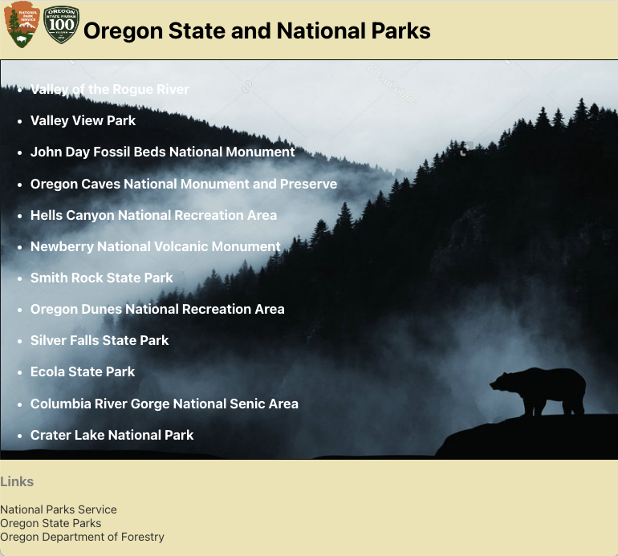

# Oregon State and National Parks List

# By Sandra Tena, Joe Roaden, and Liam Campbell

#### _A Front End REACT application that utilizes an Oregon State and National Parks API to display info for the user_

---
## Table of Contents
[Technologies Used](#technologies-used)  
[Description](#description)  
[Setup/Installation Requirements](#setup-and-installation-requirements)   
[Known Bugs](#known-bugs)  
[License](#License)

---
## Technologies Used

* _REACT_
* _JavaScript_
* _HTML_
* _CSS_
* _JSX_

---
## Description

_The user can view a list of State and National parks as well as find helpful links to the National Park Service, State Parks and Department of Forestry_

---
## Setup and Installation Requirements

<strong>Initial Setup</strong>
  

1. Copy the git repository url: https://github.com/lcmpbll/oregonparksReact
2. Open a shell program and navigate to your desktop.
3. Clone the repository for this project using the `git clone` command and including the copied URL.
4. While still in the shell program, navigate to the root directory of the newly created file named `OREGONPARKS`.
5. From the root directory, run `npm install` to install all modules that are listed on package. json file and their dependencies
6. From the root directory, run `npm run start` to view the application on your local live server.

## API SetUp and Installation

<strong>Initial Setup</strong>

<ol>
<li>Copy the git repository url: https://github.com/lcmpbll/ParksApi.Solution
<li>Open a shell program and navigate to your desktop.
<li>Clone the repository for this project using the "git clone" command and including the copied URL.
<li>While still in the shell program, navigate to the root directory of the newly created file named "ParksApi.Solution".
<li>From the root directory, navigate to the "ParksApi" directory.
<li>Move onto "SQL Workbench" instructions below to re-create database necessary to run this project.
 

<strong>SQL Workbench Configuration</strong>

<ol>
<li>Create an appsetting.json file in the "ParksApi" directory of the project*  
   <pre>ParksApi.Solution
   └── ParksApi
    └── appsetting.json</pre>
<li> Insert the following code** :  

<pre>{
   "Logging": {
    "LogLevel": {
      "Default": "Warning",
      "System": "Information",
      "Microsoft": "Information"
    }
  },
  "AllowedHosts": "*",
  "ConnectionStrings": {
    "DefaultConnection": "Server=localhost;Port=3306;database=park_api;uid=root;pwd=[YOUR-PASSWORD-HERE];"
  }
}</pre>
<small>*note: you must include your password in the code block section labeled "YOUR-PASSWORD-HERE".</small>
<small>**note: if you plan to push this cloned project to a public-facing repository, remember to add the appsettings.json file to your .gitignore before doing so.</small>

<li>Once "appsettings.json" file has been created, navigate back to SQL Workbench.

<strong>To Run</strong>

Navigate to:  
   <pre>ParksApi.Solution
   └── <strong>ParksApi</strong></pre>

Run `$ dotnet restore` in the console. 
Run `$ dotnet database update` in the console. 
Run `$ dotnet run` in the console
* _To view more information view localhost:[yourlocalhost]/index.html_
* _Additional information in JSon can also be viewed at https://localhost:[yourlocalhost]/swagger/v1/swagger.json

* _You may need to disable CORS authentication use this extension if so [Moseif](https://chrome.google.com/webstore/detail/moesif-origin-cors-change/digfbfaphojjndkpccljibejjbppifbc?hl=en-US)_

---
## Known Bugs

* _There are no known bugs at this time_

---
## License

[Copyright](LICENSE) © 2022 Sandra Tena, Liam Campbell & Joe Roaden

This project was bootstrapped with [Create React App](https://github.com/facebook/create-react-app).

<strong> Available Scripts</strong>

In the project directory, you can run:

### `npm start`

Runs the app in the development mode.\
Open [http://localhost:3000](http://localhost:3000) to view it in your browser.

The page will reload when you make changes.\
You may also see any lint errors in the console.

### `npm test`

Launches the test runner in the interactive watch mode.\
See the section about [running tests](https://facebook.github.io/create-react-app/docs/running-tests) for more information.

### `npm run build`

Builds the app for production to the `build` folder.\
It correctly bundles React in production mode and optimizes the build for the best performance.

The build is minified and the filenames include the hashes.\
Your app is ready to be deployed!

See the section about [deployment](https://facebook.github.io/create-react-app/docs/deployment) for more information.

### `npm run eject`

**Note: this is a one-way operation. Once you `eject`, you can't go back!**

If you aren't satisfied with the build tool and configuration choices, you can `eject` at any time. This command will remove the single build dependency from your project.

Instead, it will copy all the configuration files and the transitive dependencies (webpack, Babel, ESLint, etc) right into your project so you have full control over them. All of the commands except `eject` will still work, but they will point to the copied scripts so you can tweak them. At this point you're on your own.

You don't have to ever use `eject`. The curated feature set is suitable for small and middle deployments, and you shouldn't feel obligated to use this feature. However we understand that this tool wouldn't be useful if you couldn't customize it when you are ready for it.

## Learn More

You can learn more in the [Create React App documentation](https://facebook.github.io/create-react-app/docs/getting-started).

To learn React, check out the [React documentation](https://reactjs.org/).

### Code Splitting

This section has moved here: [https://facebook.github.io/create-react-app/docs/code-splitting](https://facebook.github.io/create-react-app/docs/code-splitting)

### Analyzing the Bundle Size

This section has moved here: [https://facebook.github.io/create-react-app/docs/analyzing-the-bundle-size](https://facebook.github.io/create-react-app/docs/analyzing-the-bundle-size)

### Making a Progressive Web App

This section has moved here: [https://facebook.github.io/create-react-app/docs/making-a-progressive-web-app](https://facebook.github.io/create-react-app/docs/making-a-progressive-web-app)

### Advanced Configuration

This section has moved here: [https://facebook.github.io/create-react-app/docs/advanced-configuration](https://facebook.github.io/create-react-app/docs/advanced-configuration)

### Deployment

This section has moved here: [https://facebook.github.io/create-react-app/docs/deployment](https://facebook.github.io/create-react-app/docs/deployment)

### `npm run build` fails to minify

This section has moved here: [https://facebook.github.io/create-react-app/docs/troubleshooting#npm-run-build-fails-to-minify](https://facebook.github.io/create-react-app/docs/troubleshooting#npm-run-build-fails-to-minify)

